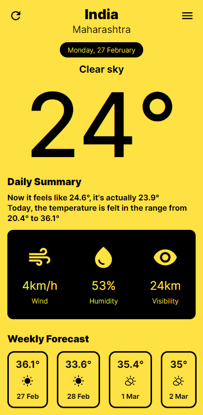

# WeatherMate

I saw [this design on dribbble](https://dribbble.com/shots/20675054-Mobile-Weather-app) and wanted to make it, so i made it into a Progressive Web App with [Elm](https://elm-lang.org/) and [Typescript](https://www.typescriptlang.org/).

I only made it for mobile, since I just followed the design, so It looks ugly on desktop.

I'm using [Open-Meteo](https://open-meteo.com/) for the weather data and [Nominatim](https://nominatim.openstreetmap.org/ui/search.html) for the address data.
